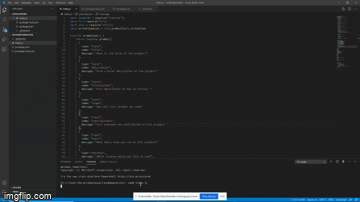

#     
# readme generator           
       
## Description
 Generates a readme.md file for the user

## Table of Contents
 * [Installation](#installation)
 * [Usage](#usage)
 * [License](#license) 
 * [Contributing](#contributing)
 * [Tests](#tests)
 * [Contact](#contact)
            
## Installation
 Before use, you must install: 
 npm init,
 npm fs, 
 and npm util 
                
## Usage
 By typing 'node index.js' into the command line like the user is doing in this example:
 
 
 
        
## License 
 The MIT License
 https://opensource.org/licenses/MIT
        
## Contributing
 Bryan Courtney contributed to this project
                
## Tests
 Error and bug handling
        
## Contact
* [bcourtney1029](https://github.com/bcourtney1029)
* bcourtney1029@gmail.com
        
